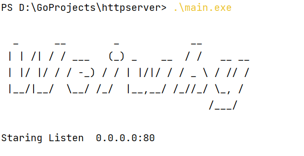
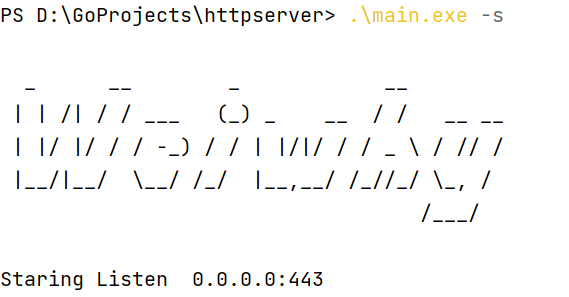
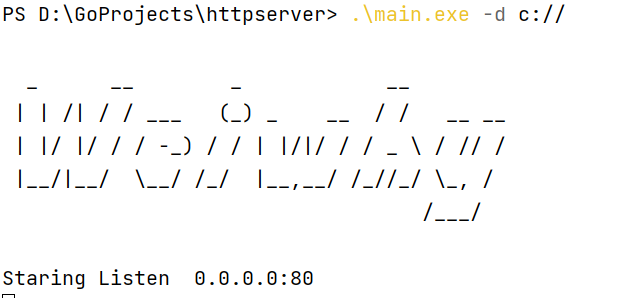

## 简介

指定目录建立http服务，用于内网临时传输文件使用。

使用方法：
```
$./http -h

  _      __        _            __
 | | /| / / ___   (_) _    __  / /   __ __
 | |/ |/ / / -_) / / | |/|/ / / _ \ / // /
 |__/|__/  \__/ /_/  |__,__/ /_//_/ \_, /
                                   /___/

Usage:

  -c string
        指定https证书文件 (default "cert.pem")
  -d string
        指定文件目录，默认当前目录 (default ".")
  -h    Shows usage options.
  -k string
        指定证书私钥文件 (default "key.pem")
  -l string
        指定监听地址和端口 (default "0.0.0.0:80")
  -s    指定使用https

$./http
  _      __        _            __
 | | /| / / ___   (_) _    __  / /   __ __
 | |/ |/ / / -_) / / | |/|/ / / _ \ / // /
 |__/|__/  \__/ /_/  |__,__/ /_//_/ \_, /
                                   /___/

Staring Listen  0.0.0.0:80

```

#### 监听80端口
```
main.exe
```

#### 启用http,默认监听443
```
main.exe -s

  _      __        _            __
 | | /| / / ___   (_) _    __  / /   __ __
 | |/ |/ / / -_) / / | |/|/ / / _ \ / // /
 |__/|__/  \__/ /_/  |__,__/ /_//_/ \_, /
                                   /___/

Staring Listen  0.0.0.0:443

```

#### 指定共享文件目录
```
PS D:\GoProjects\httpserver> .\main.exe -d c://

  _      __        _            __
 | | /| / / ___   (_) _    __  / /   __ __
 | |/ |/ / / -_) / / | |/|/ / / _ \ / // /
 |__/|__/  \__/ /_/  |__,__/ /_//_/ \_, /
                                   /___/

Staring Listen  0.0.0.0:80
```

#### 指定ssl的证书和私钥


